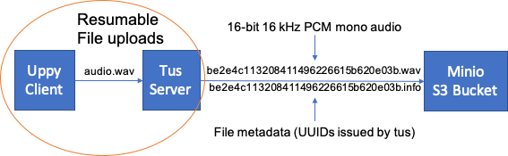

# Resumable file uploads with Uppy and tus 

Getting many multi-gigabyte wav files to your servers when a fast, reliable internet connection is not available can be a challenge. In this example, we show you how to set up an upload server and client which takes advantage of [tus](https://tus.io/), an open protocol for resumable file uploads, and [Uppy](https://uppy.io/docs/), a client-side file uploader framework that is tus-compatible.

<p align="center">
	 
</p>

In this example, we also implement a conversion step using `ffmpeg` before uploading the file to an S3 bucket using a tus post-finish hook (a script that is called by tus once all the data for a file has been received on the server).

## Usage

```
git clone https://github.com/parledoct/uppy-tus.git
cd uppy-tus
docker-compose up
```

Browse to `http://localhost:8080` to see the upload client and `http://localhost:9000` to see the Minio S3 interface (defaults access key: `minio`, secret key: `minio123`), where the converted and uploaded wav files will be placed.

## Setup overview

- `docker-compose.yml`: This file contains configuration parameters to launch the necessary services: a) an http server to host the upload client (note the `index.html` file in `src/uppy-client/` cannot be served on a `file:///` protocol), b) a tus server and c) an S3 bucket, using [Minio](https://min.io/).

- `docker-compose.env`: This file contains environment variables (e.g. `MINIO_ROOT_USER=minio`) that are fed into the Docker containers by docker-compose.

- `src/`

	- `src/uppy-client/index.html`: Uppy file upload client. To create the client, include the necessary CSS and Javascript files for Uppy, create a target `div` with an identifier (e.g. `drag-drop-area`), then create an instance of Uppy with desired parameters (e.g. accept only wav files).
	
		```html
		<link href="uppy.min.css" rel="stylesheet">
		...
		<div id="drag-drop-area"></div>
		...
		<script src="uppy.min.js"></script>
		<script>
	  		var uppy = Uppy.Core({ 
	        autoProceed: false,
	        restrictions: {
	          allowedFileTypes: ['.wav']
	        }
	      })
	      
	      uppy.use(Uppy.Dashboard, { target: '#drag-drop-area', inline: true })
	
	      uppy.use(Uppy.Tus, { 
	        endpoint: 'http://localhost:1080/files/',
	        resume: true,
	        retryDelays: [0, 1000, 3000, 5000]
	      })
		</script>
		```
		
	- `src/tus-server/`
		- `Dockerfile`: Adds `ffmpeg` and `mc` (client for Minio uploads) to the `tusproject/tusd` image. Note if you want to upload the original files straight up to an S3 bucket, you can let tus do that for you directly (see the [tusd usage documentation](https://github.com/tus/tusd/blob/master/docs/usage-binary.md)).
		
		- `minio-setup.sh`: Script to set up the Minio client (mc) on the tus server with credentials provided as environment variables (e.g. `MINIO_ROOT_USER=minio`).
		
		- `hooks/post-finish`: Shell script to convert uploaded file using ffmpeg and then upload to S3 bucket. Note as indicated in the [tus hooks documentation](https://github.com/tus/tusd/blob/master/docs/hooks.md#the-hook-directory) the hooks must not have extensions such as `.py` or `.sh`, simply the name of the event (e.g. `pre-finish`, `post-create`, etc.)

			`TUS_ID` is provided by the tus when it executes the hook and `TUS_DATA_DIR` is set in `docker-compose.yml`.
	
			```sh
			#!/bin/sh

			# Convert file to 16-bit PCM wav (codec), mono (ac), at 16 kHz (ar)
			ffmpeg -y -i ${TUS_DATA_DIR}/${TUS_ID} -acodec pcm_s16le -ac 1 -ar 16000 ${TUS_DATA_DIR}/${TUS_ID}.wav

			# Copy converted wav file to S3 bucket
			mc cp ${TUS_DATA_DIR}/$TUS_ID.wav ${TUS_DATA_DIR}/$TUS_ID.info minio/tus/

			# Delete all files from tus server
			rm ${TUS_DATA_DIR}/${TUS_ID}*
			```